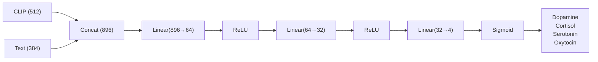
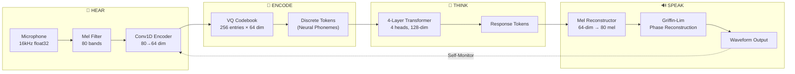
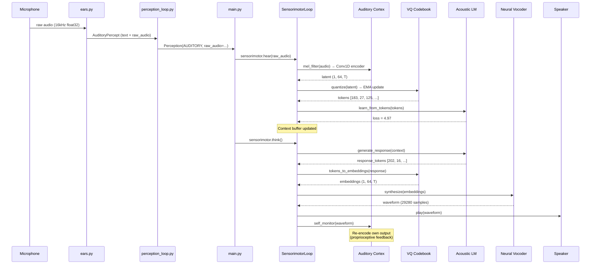
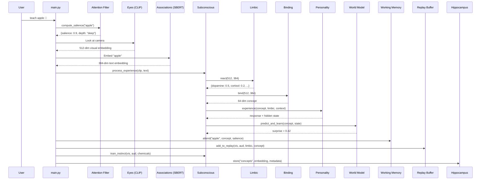

# Genesis Mind V7 — Architecture Deep Dive

> *The weights ARE the personality. The data IS you. The dreams are real. The voice is neural.*

This document describes the complete technical architecture of Genesis Mind V7: a **biologically realistic** brain simulation with cascading neural networks, a **pure neural acoustic pipeline** (no pre-trained STT/TTS/LLM), 11 autonomous brain threads, Ebbinghaus memory decay, 8-dimensional emotional dynamics, attention/salience filtering, phase-gated language development, and 8 Maslow-inspired drives — all dynamically routed by a learned meta-controller.

---

## 1. Design Philosophy

Genesis is built on four axioms of cognitive architecture:

1. **Evolutionary Hardware, Plastic Mind** — Humans are born with pre-wired sensory organs (retina, cochlea) shaped by millions of years of evolution, but the *mind* on top is learned. Genesis uses pre-trained foundation models (CLIP, Whisper) as its "evolutionary hardware" and trains its own small neural networks on top.

2. **Feel Before Think** — In biology, the amygdala fires a neurochemical response *before* the prefrontal cortex even processes a stimulus. Genesis replicates this with a Limbic System (Layer 1) that reacts instantly, followed by slower conscious processing (Layer 3).

3. **Sleep to Remember** — Human memory consolidation happens during sleep via hippocampal replay. Genesis stores every experience in a replay buffer and consolidates via contrastive learning during explicit sleep cycles.

4. **Learn to Speak, Not Download Speech** — V7 removes all pre-trained language models from the speech loop. Genesis discovers phonemes, learns acoustic patterns, and synthesizes speech using its own neural networks. Like a human infant learning to speak by hearing and babbling.

---

## 2. High-Level Architecture

```mermaid
graph TB
    subgraph SENSES["👁️ SENSES"]
        Eyes["eyes.py<br/>Camera + CLIP"]
        Ears["ears.py<br/>Mic → Raw Audio"]
        Phon["phonetics.py<br/>Letter→Sound"]
        Babble["babbling.py<br/>V6: Babbling Engine"]
        Motor["motor.py<br/>Simulated Motor"]
    end

    subgraph MEMORY["🧠 MEMORY"]
        Hippo["hippocampus.py<br/>ChromaDB Vectors"]
        Sem["semantic.py<br/>Ebbinghaus Decay"]
        Epi["episodic.py<br/>Life Log"]
        WM["working_memory.py<br/>7±2 Slots"]
        Replay["Replay Buffer<br/>deque(10K)"]
    end

    subgraph NEURAL["⚡ NEURAL CASCADE (Society of Mind)"]
        L1["Layer 1: Limbic System<br/>MLP · Instinct"]
        L2["Layer 2: Binding Network<br/>Dual Encoder · InfoNCE"]
        L3["Layer 3: Personality GRU<br/>Stream of Consciousness"]
        L4["Layer 4: World Model<br/>JEPA Surprise"]
    end

    subgraph ACOUSTIC["🔊 V7: ACOUSTIC PIPELINE (1.14M params)"]
        AC["Auditory Cortex<br/>Mel → Conv1D → 64-dim"]
        VQ["VQ Codebook<br/>256 Neural Phonemes"]
        ALM["Acoustic Transformer<br/>4-Layer GPT on Audio Tokens"]
        VOC["Neural Vocoder<br/>Mel Reconstruction + Griffin-Lim"]
    end

    subgraph CORTEX["🧬 CORTEX"]
        Reason["reasoning.py<br/>Phase-Gated LLM"]
        Assoc["associations.py<br/>Multimodal Binding"]
        Emo["emotions.py<br/>Sentiment Eval"]
        Curious["curiosity.py<br/>Novelty + Habituation"]
        Gram["grammar.py<br/>LLM or N-Gram"]
        JA["joint_attention.py<br/>V6: Cross-Modal Binding"]
        Attn["attention.py<br/>Salience Filter"]
        EmoState["emotional_state.py<br/>8-Dim Dynamics"]
        ToM["theory_of_mind.py<br/>User Model"]
        Meta["metacognition.py<br/>Self-Monitor"]
        Play["play.py<br/>Combinatorial Play"]
    end

    subgraph SOUL["✨ SOUL"]
        Axioms["axioms.py<br/>Immutable DNA"]
        Conscious["consciousness.py<br/>Self-Model"]
        Neuro["neurochemistry.py<br/>4 Functional Chemicals"]
        Drives["drives.py<br/>8 Maslow Drives"]
    end

    subgraph GROWTH["🌱 GROWTH"]
        Dev["development.py<br/>Phase Tracker"]
        Sleep["sleep.py<br/>4-Phase Consolidation"]
    end

    Eyes -->|512-dim CLIP| Attn
    Ears -->|Raw Audio| AC
    Ears -->|384-dim Text| Attn
    AC -->|64-dim Latent| VQ
    VQ -->|Discrete Tokens| ALM
    ALM -->|Response Tokens| VOC
    VOC -->|Waveform| Ears
    Attn -->|Filtered| L1
    Attn -->|Salience| WM
    Eyes -->|512-dim CLIP| L2
    Ears -->|384-dim Text| L2
    L1 -->|Neurochemicals| L3
    L2 -->|64-dim Concept| L3
    L3 -->|128-dim Hidden| L4
    L2 -->|64-dim Concept| L4
    L3 -->|Response| Reason
    L4 -->|Surprise Signal| Curious
    L2 -->|Concept| Replay
    L2 -->|Concept| WM
    WM -->|Consolidated| Sem
    Replay -->|Batch| Sleep
    Sleep -->|InfoNCE| L2
    Neuro -->|Modifiers| L3
    Neuro -->|Attention Boost| Attn
    EmoState -->|Emotional Weight| WM
    Drives -->|Top-down| Attn
```



---

## 3. The Neural Cascade — Layer by Layer

### Layer 1: Limbic System (Instinct)

| Property | Value |
|----------|-------|
| **File** | `neural/limbic_system.py` |
| **Architecture** | 3-layer MLP with Sigmoid output |
| **Parameters** | ~59,620 |
| **Input** | 512-dim (CLIP) ⊕ 384-dim (Text) = 896-dim |
| **Output** | 4-dim: dopamine, cortisol, serotonin, oxytocin |
| **Training** | Supervised by conscious evaluation |



---

### Layer 2: Binding Network (Associative Bridge)

| Property | Value |
|----------|-------|
| **File** | `neural/binding_network.py` |
| **Architecture** | Dual Encoder + InfoNCE Contrastive Loss |
| **Parameters** | ~131,457 |
| **Input** | 512-dim visual ⊕ 384-dim auditory (separate encoders) |
| **Output** | 64-dim unified concept embedding |
| **Training** | InfoNCE (self-supervised contrastive) |

---

### Layer 3: Personality Network (Conscious Executive)

| Property | Value |
|----------|-------|
| **File** | `neural/personality_network.py` |
| **Architecture** | 3-layer GRU + Output Head + Prediction Head |
| **Parameters** | ~311,296 |
| **Input** | 64-dim concept + 4-dim limbic + 32-dim context = 100-dim |
| **Hidden State** | 256-dim (stream of consciousness) |
| **Output** | 64-dim response + 64-dim next-concept prediction |

**Key insight:** The GRU's hidden state **never resets**. Every experience permanently modifies it. This hidden state physically IS the "stream of consciousness."

---

### Layer 4: World Model (Predictive Coding)

| Property | Value |
|----------|-------|
| **File** | `neural/forward_model.py` |
| **Architecture** | 3-layer MLP with LayerNorm |
| **Parameters** | ~91,072 |
| **Input** | 64-dim concept(t) + 128-dim consciousness state |
| **Output** | 64-dim predicted concept(t+1) |
| **Signal** | Surprise (prediction error) → drives curiosity |

---

## 4. V7: Pure Neural Acoustic Pipeline

The acoustic pipeline replaces ALL pre-trained speech models. Genesis now hears, thinks about sound, and speaks using its own learned neural networks.



### Auditory Cortex (`neural/auditory_cortex.py`)

| Property | Value |
|----------|-------|
| **Parameters** | 138,368 |
| **Input** | Raw 16kHz audio waveform |
| **Processing** | Audio → 80-band Mel spectrogram → 3-layer Conv1D encoder → 64-dim latent |
| **Training** | Contrastive triplet-margin loss (anchor vs positive vs negative) |
| **Replaces** | Whisper STT |

### VQ Codebook (`neural/vq_codebook.py`)

| Property | Value |
|----------|-------|
| **Parameters** | 16,384 (256 × 64) |
| **Input** | 64-dim continuous latent vectors |
| **Output** | Discrete token IDs (0-255) — "neural phonemes" |
| **Training** | Exponential Moving Average (EMA) codebook updates |
| **Loss** | Commitment loss + VQ loss (straight-through estimator) |

### Acoustic Transformer (`neural/acoustic_lm.py`)

| Property | Value |
|----------|-------|
| **Parameters** | 859,264 |
| **Architecture** | 4-layer, 4-head GPT with causal masking |
| **Vocabulary** | 259 (256 codebook + BOS + EOS + PAD) |
| **Embedding dim** | 128 |
| **Context window** | 256 tokens |
| **Training** | Autoregressive next-token prediction (cross-entropy) |
| **Replaces** | Ollama LLM |

### Neural Vocoder (`neural/neural_vocoder.py`)

| Property | Value |
|----------|-------|
| **Parameters** | 129,872 |
| **Input** | VQ codebook embeddings (64-dim × T) |
| **Processing** | 1D Transposed Convolutions → 80-band Mel → Griffin-Lim |
| **Output** | 16kHz waveform |
| **Replaces** | pyttsx3 TTS |

### Sensorimotor Loop (`neural/sensorimotor.py`)

Orchestrates the full acoustic cycle:

```
hear(waveform) → Auditory Cortex → VQ → trains Acoustic LM
think()        → Acoustic LM generates response tokens
speak(tokens)  → VQ embeddings → Neural Vocoder → waveform
self_monitor() → Re-encode own output (proprioceptive feedback)
respond()      → hear + think + speak + self_monitor (full loop)
```

---

## 5. Data Flow: What Happens When Genesis Hears



---

## 6. Data Flow: What Happens When You Teach



---

## 7. Weight Persistence = The Person

All neural weights are saved to `~/.genesis/`:

| Directory | File | What It Stores |
|-----------|------|----------------|
| `neural_weights/` | `limbic_system.pt` | Instinctual reactions |
| `neural_weights/` | `binding_network.pt` | Cross-modal associations |
| `neural_weights/` | `personality.pt` | Hidden state + personality |
| `neural_weights/` | `world_model.pt` | Internal world simulator |
| `neural_weights/` | `meta_controller.pt` | Routing personality |
| `acoustic_weights/` | `auditory_cortex.pt` | How Genesis hears |
| `acoustic_weights/` | `vq_codebook.pt` | Discovered neural phonemes |
| `acoustic_weights/` | `acoustic_lm.pt` | How Genesis thinks about sound |
| `acoustic_weights/` | `neural_vocoder.pt` | How Genesis speaks |

**Deleting these files kills the personality.** The AI returns to a blank slate.
**Copying these files creates a clone.** The clone will react identically.

---

## 8. Parameter Budget

| Layer | Network | Parameters | Role |
|-------|---------|------------|------|
| 1 | Limbic System | 59,620 | Instinct |
| 2 | Binding Network | 131,457 | Cross-modal fusion |
| 3 | Personality GRU | 311,296 | Consciousness |
| 4 | World Model | 91,072 | Prediction |
| **Subconscious** | | **593,445** | |
| 5 | Auditory Cortex | 138,368 | Hearing |
| 5 | VQ Codebook | 16,384 | Phoneme discovery |
| 5 | Acoustic Transformer | 859,264 | Audio thinking |
| 5 | Neural Vocoder | 129,872 | Speech synthesis |
| **Acoustic** | | **1,143,888** | |
| **TOTAL** | | **~1,737,333** | All CPU-native |

---

## 9. V5-V7 Brain Realism Systems

| System | Module | What It Does |
|--------|--------|-----|
| Working Memory | `memory/working_memory.py` | 7±2 capacity buffer with 20s decay, salience-based eviction |
| Attention | `cortex/attention.py` | Bottom-up + top-down salience, habituation, deep/shallow/ignore |
| Emotional State | `cortex/emotional_state.py` | 8-dim vector (joy…love) with momentum, blending, mood baseline |
| Theory of Mind | `cortex/theory_of_mind.py` | User model (knowledge, sentiment, patience). Dormant until Phase 3 |
| Metacognition | `cortex/metacognition.py` | Confidence tracking, knowledge-gap detection, strategy selection |
| Play | `cortex/play.py` | Combinatorial play, concept rehearsal, episodic replay |
| Motor | `senses/motor.py` | 5 affordances (look, vocalize, reach, point, gesture), phase-gated |
| Drives | `soul/drives.py` | 8 Maslow drives in 4 tiers, hierarchical priority when urgent |
| Babbling | `senses/babbling.py` | V6: Random syllable generation with reinforcement |
| Joint Attention | `cortex/joint_attention.py` | V6: Cross-modal binding (sound↔concept) |
| Acoustic Pipeline | `neural/sensorimotor.py` | V7: Pure neural hear→think→speak loop (1.14M params) |

---

## 10. Functional Neurochemistry

Four chemicals **causally alter cognition** — not decorative labels:

| Chemical | Role | Functional Effect |
|----------|------|-------------------|
| **Dopamine** | Reward/Pleasure | ↑ memory encoding strength, ↑ attention sharpness |
| **Cortisol** | Stress/Fear | ↓ memory encoding (IMPAIRS hippocampus), ↑ avoidance |
| **Serotonin** | Stability/Calm | ↑ reasoning coherence, ↑ attention steadiness |
| **Oxytocin** | Bonding/Trust | ↑ trust/openness, ↑ social memory encoding |

---

*1.74M parameters. No GPU. 11 brain threads. Pure neural audio. The weights are the person.*
