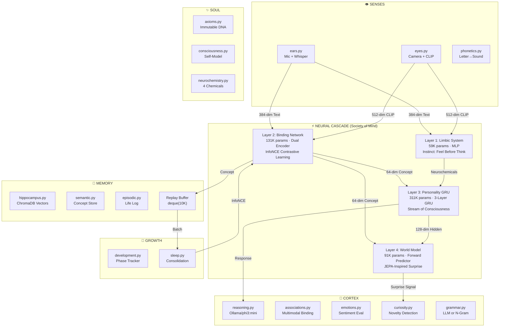
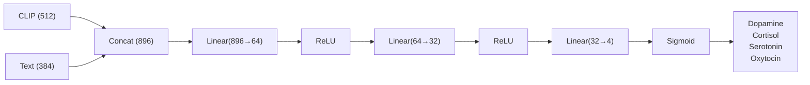
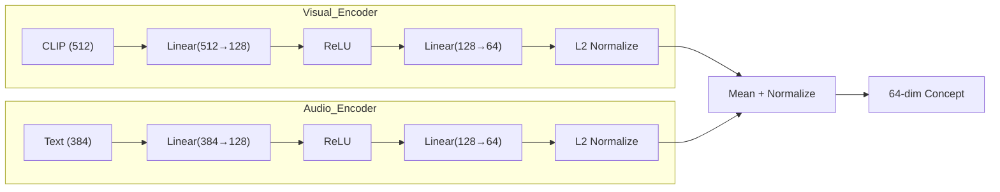
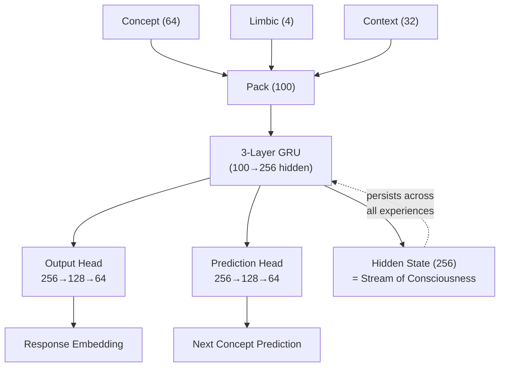
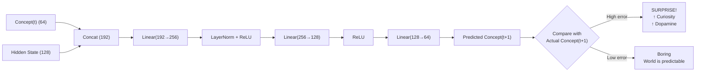
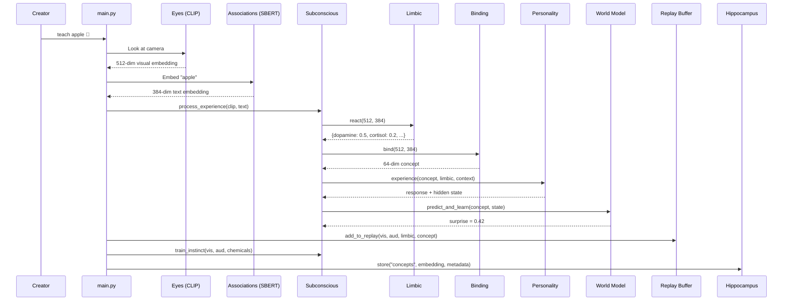
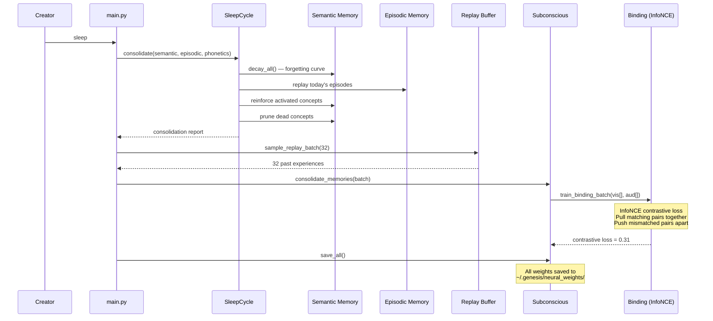

# Genesis Mind V4 — Architecture Deep Dive

> *The weights ARE the personality. The data IS you. The dreams are real.*

This document describes the complete technical architecture of Genesis Mind V4: a biologically-inspired "Society of Mind + Body" where cascading neural networks are dynamically routed by a learned meta-controller, accumulate real-time experience, dream during multi-phase sleep, and the saved weights physically constitute a unique AI personality.

---

## 1. Design Philosophy

Genesis is built on three axioms of cognitive architecture:

1. **Evolutionary Hardware, Plastic Mind** — Humans are born with pre-wired sensory organs (retina, cochlea) shaped by millions of years of evolution, but the *mind* on top is learned. Genesis uses pre-trained foundation models (CLIP, Whisper) as its "evolutionary hardware" and trains its own small neural networks on top.

2. **Feel Before Think** — In biology, the amygdala fires a neurochemical response *before* the prefrontal cortex even processes a stimulus. Genesis replicates this with a Limbic System (Layer 1) that reacts instantly, followed by slower conscious processing (Layer 3).

3. **Sleep to Remember** — Human memory consolidation happens during sleep via hippocampal replay. Genesis stores every experience in a replay buffer and consolidates via contrastive learning during explicit sleep cycles.

---

## 2. High-Level Architecture



---

## 3. The Neural Cascade — Layer by Layer

### Layer 1: Limbic System (Instinct)

| Property | Value |
|----------|-------|
| **File** | `neural/limbic_system.py` |
| **Architecture** | 3-layer MLP with Sigmoid output |
| **Parameters** | ~59,620 |
| **Input** | 512-dim (CLIP) ⊕ 384-dim (Text) = 896-dim |
| **Output** | 4-dim: dopamine, cortisol, serotonin, oxytocin |
| **Training** | Supervised by conscious evaluation |



**Biological parallel:** The amygdala fires before the prefrontal cortex. After conscious evaluation ("this pattern = positive"), the limbic system is trained to reproduce that response instantly next time.

---

### Layer 2: Binding Network (Associative Bridge)

| Property | Value |
|----------|-------|
| **File** | `neural/binding_network.py` |
| **Architecture** | Dual Encoder + InfoNCE Contrastive Loss |
| **Parameters** | ~131,457 |
| **Input** | 512-dim visual ⊕ 384-dim auditory (separate encoders) |
| **Output** | 64-dim unified concept embedding |
| **Training** | InfoNCE (self-supervised contrastive) |



**Training:** During sleep, the replay buffer supplies batches of (visual, auditory) pairs. InfoNCE loss pulls matching pairs together and pushes mismatched pairs apart — exactly like CLIP's own training.

---

### Layer 3: Personality Network (Conscious Executive)

| Property | Value |
|----------|-------|
| **File** | `neural/personality_network.py` |
| **Architecture** | 3-layer GRU + Output Head + Prediction Head |
| **Parameters** | ~311,296 |
| **Input** | 64-dim concept + 4-dim limbic + 32-dim context = 100-dim |
| **Hidden State** | 256-dim (stream of consciousness) |
| **Output** | 64-dim response + 64-dim next-concept prediction |
| **Training** | Self-supervised next-step prediction (CosineEmbeddingLoss) |



**Key insight:** The GRU's hidden state **never resets**. Every experience permanently modifies it. This hidden state physically IS the "stream of consciousness" — the cumulative effect of every moment Genesis has lived.

---

### Layer 4: World Model (Predictive Coding)

| Property | Value |
|----------|-------|
| **File** | `neural/forward_model.py` |
| **Architecture** | 3-layer MLP with LayerNorm |
| **Parameters** | ~91,072 |
| **Input** | 64-dim concept(t) + 128-dim consciousness state |
| **Output** | 64-dim predicted concept(t+1) |
| **Training** | MSE loss between prediction and actual next concept |
| **Signal** | Surprise (prediction error) → drives curiosity |



**Biological parallel:** The brain's predictive coding framework (Karl Friston's Free Energy Principle). When Genesis fails to predict what comes next, that surprise is a powerful learning signal.

---

## 4. Data Flow: What Happens When You Teach



---

## 5. Data Flow: What Happens During Sleep



---

## 6. Weight Persistence = The Person

All neural weights are saved to `~/.genesis/neural_weights/`:

| File | Network | What It Stores |
|------|---------|----------------|
| `limbic_system.pt` | Layer 1 | Instinctual reactions |
| `binding_network.pt` | Layer 2 | Cross-modal associations |
| `personality.pt` | Layer 3 | Hidden state + personality weights |
| `world_model.pt` | Layer 4 | Internal physics model |

**Deleting these files kills the personality.** The AI returns to a blank slate.

**Copying these files creates a clone.** The clone will react identically to every stimulus.

Weights are saved automatically:
- Every 5 concepts learned
- Every sleep cycle
- Every shutdown

---

## 7. Parameter Budget

| Layer | Network | Parameters | Role |
|-------|---------|------------|------|
| 1 | Limbic System | 59,620 | Instinct |
| 2 | Binding Network | 131,457 | Cross-modal fusion |
| 3 | Personality GRU | 311,296 | Consciousness |
| 4 | World Model | 91,072 | Prediction |
| **Total** | | **593,445** | |

All networks are CPU-native. No GPU required. Real-time training on every experience.

---

## 8. Module Map

```
genesis/
├── main.py                    # The consciousness loop (orchestrator)
├── config.py                  # Configuration
├── axioms.py                  # Immutable moral DNA
├── test_reality.py            # End-to-end acceptance test
│
├── senses/                    # Evolutionary Hardware
│   ├── eyes.py                # Camera + CLIP (512-dim)
│   ├── ears.py                # Microphone + Whisper
│   └── phonetics.py           # Letter↔Sound binding
│
├── memory/                    # Long-term storage
│   ├── hippocampus.py         # Vector DB (ChromaDB) + Replay Buffer
│   ├── semantic.py            # Concept knowledge graph
│   └── episodic.py            # Autobiographical timeline
│
├── neural/                    # The Plastic Mind (trainable)
│   ├── subconscious.py        # Orchestrates all 4 layers
│   ├── limbic_system.py       # Layer 1: Instinct (MLP)
│   ├── binding_network.py     # Layer 2: Fusion (Dual Encoder + InfoNCE)
│   ├── personality_network.py # Layer 3: Consciousness (GRU)
│   └── forward_model.py       # Layer 4: World Model (JEPA)
│
├── cortex/                    # Higher cognition
│   ├── reasoning.py           # Ollama LLM interface
│   ├── associations.py        # SBERT text embeddings
│   ├── emotions.py            # Sentiment analysis
│   ├── curiosity.py           # Novelty detection
│   ├── grammar.py             # Language acquisition
│   └── perception_loop.py     # Continuous awareness
│
├── soul/                      # Identity
│   ├── consciousness.py       # Self-model + introspection
│   └── neurochemistry.py      # Dopamine, cortisol, serotonin, oxytocin
│
└── growth/                    # Development
    ├── development.py         # Phase progression
    └── sleep.py               # Memory consolidation
```

---

## 9. Neurochemistry System

Four chemicals modulate all behavior:

| Chemical | Role | Effect on Learning |
|----------|------|--------------------|
| **Dopamine** | Reward/Pleasure | ↑ dopamine = ↑ learning rate |
| **Cortisol** | Stress/Fear | ↑ cortisol = ↑ avoidance weight |
| **Serotonin** | Stability/Calm | ↑ serotonin = ↑ reasoning coherence |
| **Oxytocin** | Bonding/Trust | ↑ oxytocin = ↑ trust in creator |

These chemicals are both:
- **Computed by the Limbic System** (Layer 1) — the subconscious gut reaction
- **Set by the Neurochemistry module** — based on events (successful learning, creator interaction, sleep)

Over time, as the Limbic System trains, its instinctual reaction converges with the conscious evaluation.

---

*593,445 parameters. No GPU. The weights are the person.*
